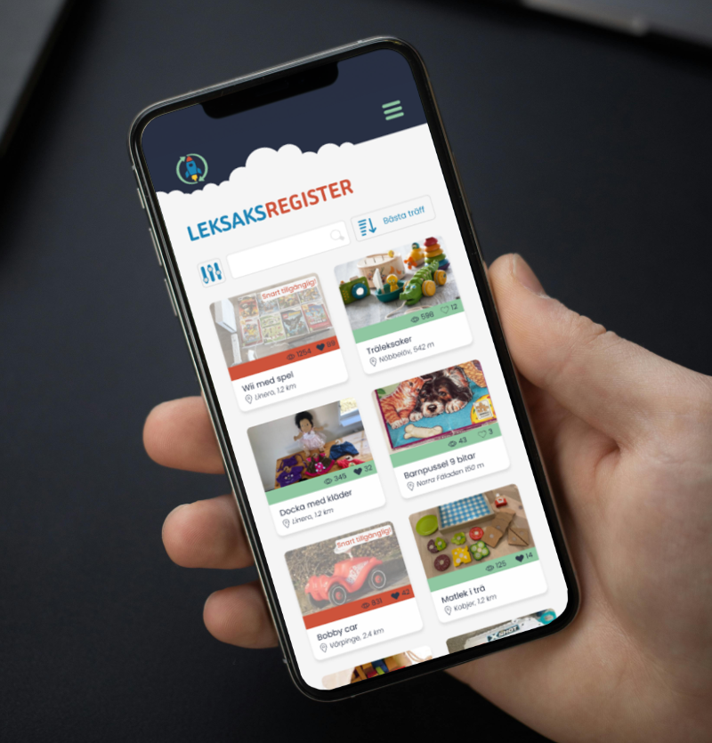
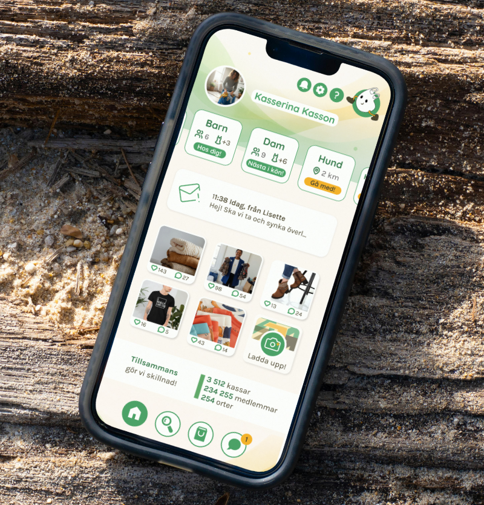
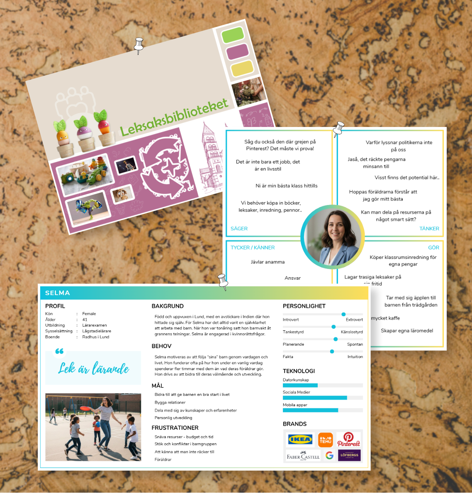
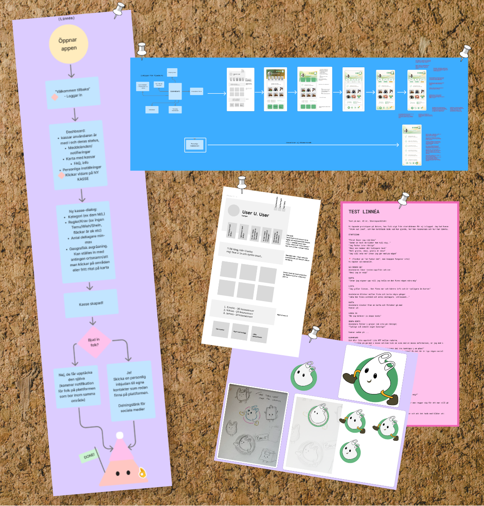

# UX/UI

Deliverables and takeaways from our UX/UI course, as part of a two year Higher Vocal Education (Yrkeshögskola) in Frontend Development with React.

👇 **Scroll for images!** 

## Takeaways and acquired skills:
- **Proficiency with Figma:** Creating wireframes, high-fidelity mockups, and interactive prototypes for web and mobile interfaces. FigJam for interactive workshops, brainstorming and mapping within teams.
- **Industry specific terminology:** Mastering core concepts such as UX/UI, accessibility, usability, and information architecture.
- **Design thinking in a tech context:** Applying an iterative process through the stages of Empathize, Define, Ideate, Prototype, and Test with appropriate deliverables.
- **Analysis and design based on gestalt principles and UX-laws**: Utilizing laws and principles to guide user focus.
- **User research and Empathy:** Developing User Personas and Empathy Maps to understand user needs, behaviors, and pain points.
- **User Journey Mapping:** Visualizing the end-to-end process a user undergoes to achieve specific goals, including emotional triggers.
- **Information Architecture & Flow:** Structuring content and navigation through the creation of Sitemaps and Flowcharts to ensure logical user paths.
- **Visual Design Foundations in tech context:** Implementing visual hierarchy using size, color, typography, and "visual cues" to reduce cognitive load.
- **Prototyping:** Developing both Low-fidelity (sketches/wireframes) and High-fidelity (pixel-perfect) models to communicate design intent.
- **Usability Testing:** Evaluating designs through methods like "Thinking Aloud" gather actionable feedback.

## Deliverables completed:
- **Empathy Maps** for user personas
- **User Personas** representing specific target audiences
- **User Journey Maps** documenting pain points and opportunities
- **Flowcharts** illustrating user interactions and app architecture
- **High-fidelity Mockups** created in Figma with a focus on Gestalt principles and the practical application of UX-laws
- **Moodboards** for early concept communication
- **Design documents** for pin-pointing the design through colour schemes, typography and mannerism
- 

## Snapshots from the course
Material made by me in group assignments!
|||
|-|-|
|  |  | 
|  |  |

